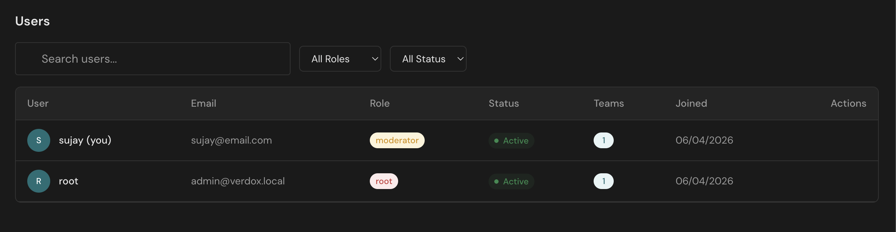
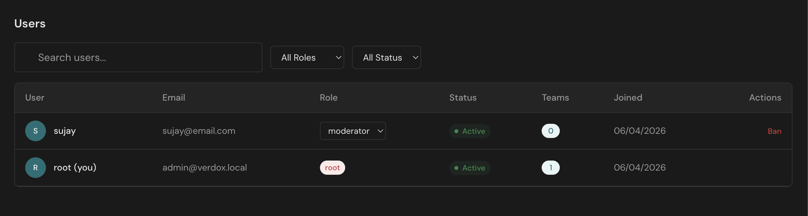
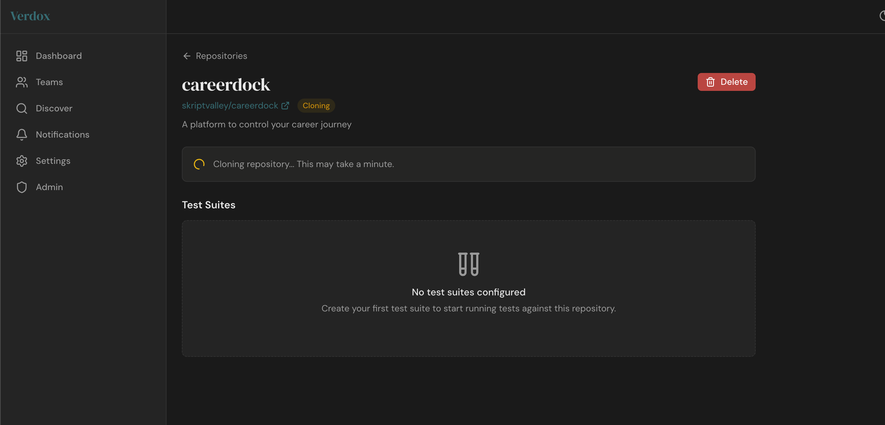
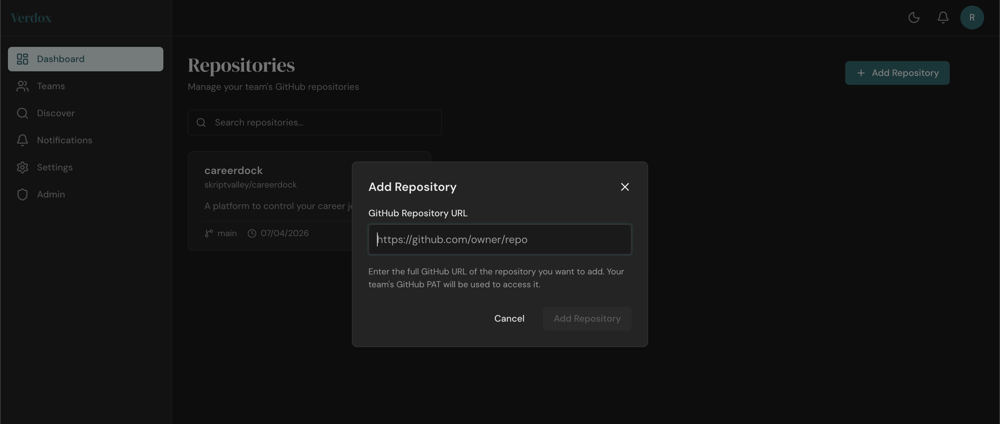
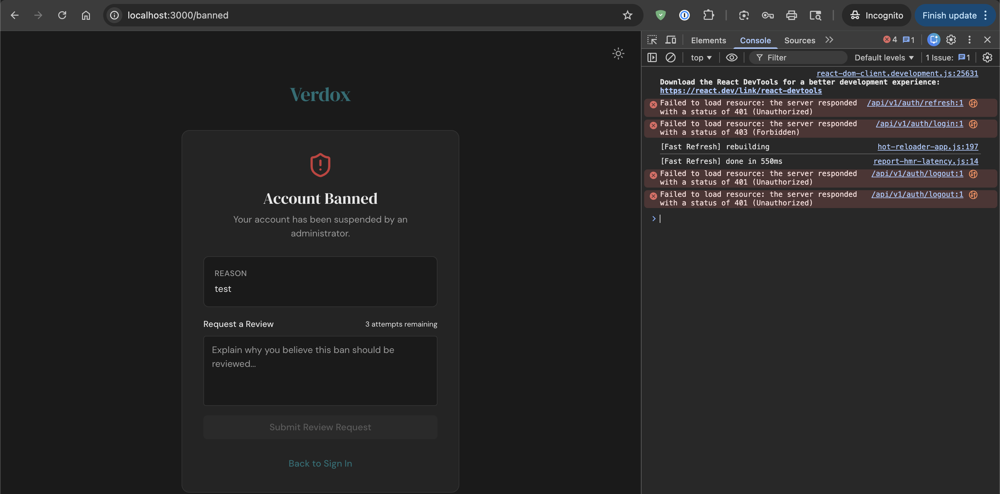
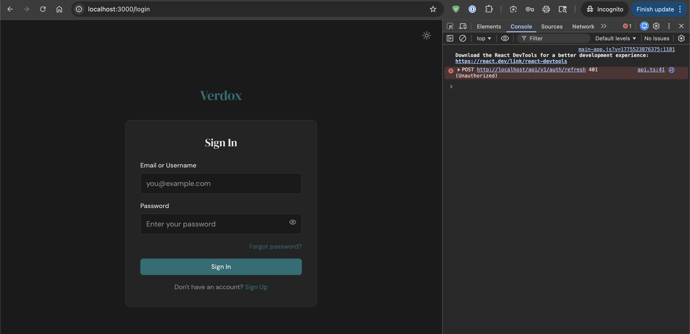
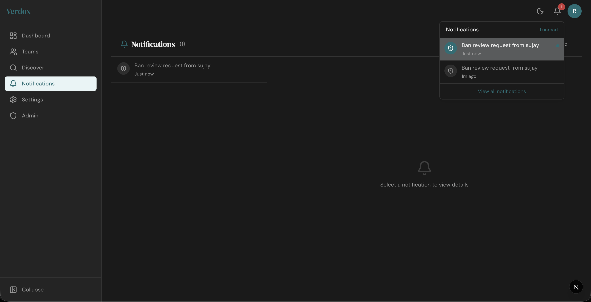
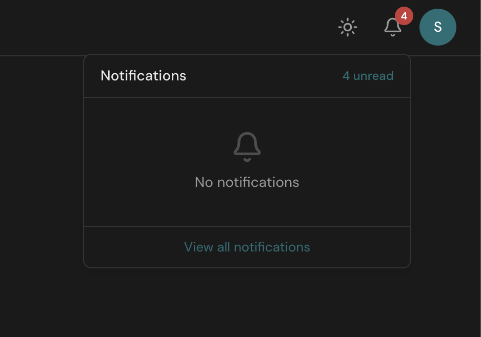
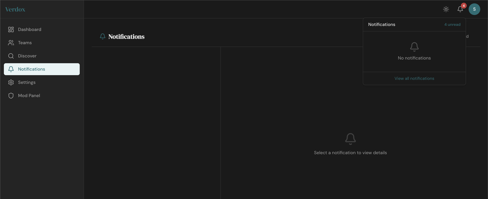
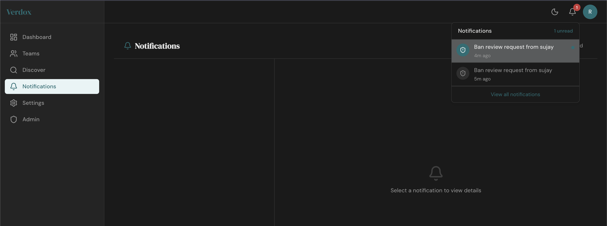

# Prompt: Investigate and Address These Verdox Session 02 Issues

Review the following feedback and turn it into a concrete debugging and implementation plan for Verdox. Do not drop any statement, question, example, or nuance. If a point is phrased as a question, uncertainty, or possible direction, preserve that and evaluate it instead of silently converting it into a fixed decision.

Use the screenshots in `ai/res/screenshots/session_02` as supporting evidence while reviewing the issues below.

In your response:

- preserve every issue, question, and example below
- refine every section into a practical implementation and debugging plan
- explain likely root causes and where the problem most likely lives
- call out frontend, backend, auth/session, live-update, data-sync, team/repository ownership, and GitHub integration implications where relevant
- identify missing prerequisites, env/config requirements, tradeoffs, dependencies, and risks
- recommend the best implementation order
- for each section, clearly state expected behavior after the fix

## 1. Admin Panel Team Count Does Not Update

Evidence:

Refined points to address:

- Investigate why the admin panel does not update the teams count after updating a user's team from another moderator panel.
- Determine whether this is caused by stale frontend state, missing query invalidation, missing live update propagation, or the backend/admin users response not recalculating team counts after the team change.
- Define the expected behavior clearly: once a user's team assignment changes from another panel, the admin panel should reflect the updated teams count without requiring a manual refresh.

## 2. Repository Cloning and GitHub Account Workflow

Evidence:

Refined points and questions to address:

- Investigate why a repo gets stuck cloning forever and define how Verdox should surface progress, timeout, failure, retry, or recovery states instead of leaving the repository in a permanent cloning state.
- Evaluate whether root GitHub account credentials can be configured in `.env` along with the admin PAT from that same account for forking added repositories.
- Evaluate whether simply working on a fork would solve the current problem if repository cloning keeps getting stuck.
- Evaluate whether container mode should be removed entirely and whether fork-based GitHub Actions should become the default execution path.
- Preserve this example and assess it directly: I have a GitHub account with `skriptvalley@gmail.com` which has access to the org and repos I want to add in Verdox, along with a PAT generated from this account, with admin privilidges right now for testing.
- Determine whether the above credentials should be configurable via `.env` so they can be mapped to the root account for repository forks by default in teams.
- Determine whether PAT configuration in team settings should be restructured so teams can configure the GitHub accounts where repos should be forked for test runs, along with the relevant credentials and PAT.
- Refine the repository creation flow so adding a repository requires selecting the team to which it needs to be added.
- Clarify how repository ownership, fork ownership, default root-level credentials, and team-level credential overrides should work together.

## 3. Test Suite Creation Flow and Verdox Workflow Commit Strategy

Refined points to address:

- Redesign the test suite creation flow so it starts with adding the basic information about the test suite.
- After basic information is added, move the flow to defining the Verdox workflow that should be placed on top of the testing branch.
- Evaluate and refine the idea that this workflow definition can be represented as a UI form so Verdox can create and maintain the required output artifacts consistently.
- Ensure the workflow definition step is explicit about the required output artifacts Verdox expects to read and render.
- The backend should maintain a single commit for addition and removal of test suite workflows on a branch in the forked repository.
- For any change in an existing suite workflow, any new workflow addition, or any workflow removal, the backend should amend that same single commit instead of creating a growing history of Verdox-managed workflow commits.
- Clarify how that single Verdox workflow commit should be created, stored, updated, and reapplied safely in the forked repository.
- The single Verdox workflow commit should be cherry-picked or applied on top of the branch being tested so that branch has the required workflow before test execution.
- Clarify how this commit-management strategy should behave when the target branch changes, the fork is resynced, or multiple suites exist for the same repository or branch.
- The last commit hash shown in the UI dashboard should ignore the Verdox workflow commit and should still show the top commit that actually belongs to the code being tested.
- Define the expected behavior clearly: Verdox-managed workflow injection should be transparent in the UI, should not confuse the reported commit being tested, and should give users a predictable flow from test suite metadata to workflow definition to execution.

## 4. Banned User Page, Errors, and Sign-Out Behavior

Evidence:

Refined points to address:

- Investigate and remove the console errors that appear for a banned user on the banned page.
- Ensure the banned user's email is shown on the banned page.
- Make `Back to Sign In` fully sign out the user in the browser session instead of only navigating away.
- Check whether auth refresh, logout, or other session-related requests are still firing in a way that creates noisy console errors or inconsistent session state for banned users.
- Define the expected behavior clearly: while banned, the user should see the banned experience cleanly, with the correct account details, and the sign-in path should leave no stale authenticated browser session behind.

## 5. Notifications and Mail Flow Are Not Staying in Sync

General notifications evidence:

Receiver account evidence:

Sender account evidence:

Refined points to address:

- Investigate why the notification bell is updating in real time but the notifications page itself is not showing the new notification without refresh.
- Investigate why the notifications page does not refresh if I am already on it and click on new notifications.
- Investigate why, after sending a mail, notifications are not working properly with unread count and in-page state.
- Investigate why read status and other related notification state transitions are not working.
- Ensure the unread count, bell dropdown, notifications page list, selected notification detail view, and read/unread state all remain in sync.
- Evaluate the full sender and receiver flow so notification state stays consistent across both accounts when the trigger is an in-app notification or a mail-triggered notification.

## Response Expectation

Do not simplify these notes by removing details. I want them rewritten and addressed as a detailed implementation prompt that preserves the meaning of every issue, question, and example while making each section clearer and more actionable.
